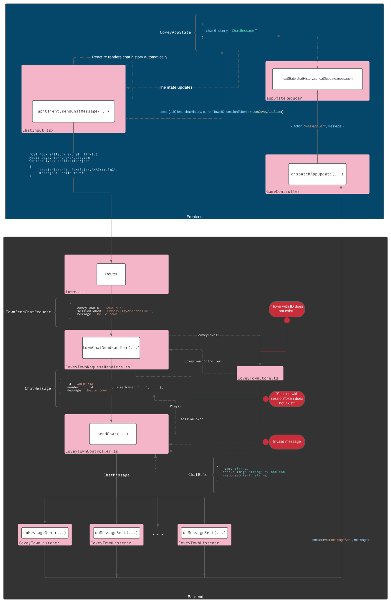

# Quick Chat Documentation

---

- [Architecture](#architecture)
  - [High level overview](#high-level-overview)
  - [In-depth, step-by-step flow](#in-depth-step-by-step-flow)
    - [The sender sends a request via the REST API.](#the-sender-sends-a-request-via-the-rest-api)
      - [HTTP](#http)
      - [cURL](#curl)
    - [The server recieves and parses the request.](#the-server-recieves-and-parses-the-request)
    - [The request handler interprets the request data and dispatches it to the town controller.](#the-request-handler-interprets-the-request-data-and-dispatches-it-to-the-town-controller)
      - [Errors](#errors)
    - [The message is validated by the controller.](#the-message-is-validated-by-the-controller)
      - [Errors](#errors-1)
    - [The message is stored in the controller and all the `CoveyTownListeners` subscribed to the town are alerted.](#the-message-is-stored-in-the-controller-and-all-the-coveytownlisteners-subscribed-to-the-town-are-alerted)
    - [The socket emits an event to the client.](#the-socket-emits-an-event-to-the-client)
    - [The client recieves the message and renders it on screen.](#the-client-recieves-the-message-and-renders-it-on-screen)
- [Error handling](#error-handling)
  - [Town with ID does not exist.](#town-with-id-does-not-exist)
  - [Session with sessionToken does not exist.](#session-with-sessiontoken-does-not-exist)
  - [Message breaks validation rules](#message-breaks-validation-rules)
- [Proposed changes to existing codebase](#proposed-changes-to-existing-codebase)
  - [Add send chat REST API.](#add-send-chat-rest-api)
  - [Modify socket implementation to support `sendChat` event.](#modify-socket-implementation-to-support-sendchat-event)
  - [Add `ChatInput` component to `App`.](#add-chatinput-component-to-app)
  - [Modify `WorldMap` to support showing messages above avatars.](#modify-worldmap-to-support-showing-messages-above-avatars)

## Architecture

### High level overview


### In-depth, step-by-step flow

Consider a town with multiple connected players:

- the ID of the town is `1A08F7F2`
- the sender is connected to the town and their session token is `PbMc3xlssyAMAZrbeJ3mG`
- the sender wants to say `hello town!`



#### The sender sends a request via the REST API.

> **Note:** The frontend UI is the intended interface that users will use to send messages. It will automatically generate the following requests _and_ provide interactive feedback while the user is entering a message. See [FEATURE.md](FEATURE.md) for details about the frontend and our user stories.

##### HTTP

```HTTP
POST /towns/1A08F7F2/chat HTTP/1.1
Host: covey-town.herokuapp.com
Content-Type: application/json

{
    "sessionToken": "PbMc3xlssyAMAZrbeJ3mG",
    "message": "hello town!"
}
```

##### cURL

```shell-session
curl --location --request POST 'https://covey-town.herokuapp.com/1A08F7F2/chat' \
--header 'Content-Type: application/json' \
--data-raw '{
    "sessionToken": "PbMc3xlssyAMAZrbeJ3mG",
    "message": "hello town!"
}'
```

---

#### The server recieves and parses the request.

The request data is used to create a `TownChatSendRequest` object, which is passed to the `townChatSendHandler`:

```ts
{
    coveyTownID: '1A08F7F2',
    sessionToken: 'PbMc3xlssyAMAZrbeJ3mG',
    message: 'hello town!'
}
```

---

#### The request handler interprets the request data and dispatches it to the town controller.

The handler will clean the message of any preceeding/trailing white space and illegal characters. If the town ID is valid, the handler will query the associated controller for the `Player` object associated with the given session token. The handler will then generate a unique ID for the message and create a `ChatMessage` object to pass to the controller:

```ts
{
    id: 'ABCD1234',
    sender: { _id_: '...' , _userName: '...', ... },
    message: 'hello town!'
}
```

##### Errors

> - [Town with ID does not exist.](#town-with-id-does-not-exist)
> - [Session with sessionToken does not exist.](#session-with-sessiontoken-does-not-exist)

---

#### The message is validated by the controller.

> **Note:** Currently, controllers only use the default set of rules defined by `ChatMessageRules`, but this can be customized.

The controller will check the string against all validation rules. Some of these rules use environment variables that can be customized when setting up.

##### Errors

> - [Message breaks validation rules.](#message-breaks-validation-rules)

---

#### The message is stored in the controller and all the `CoveyTownListeners` subscribed to the town are alerted.

When a message passes validation, it is stored in the controller's `_chatHistory` property and all subscribed listeners are dispatched.

---

#### The socket emits an event to the client.

The socket emits a `sendChat` event and the `ChatMessage` object to each connected session.

---

#### The client recieves the message and renders it on screen.

When the frontend recieves the `sendChat` event, it will append the message to `chatHistory` property of the the global app state and render the message in the world using the Phaser API. Each client will see the message appear above the sender's avatar.

The toggleable chat history displays all the messages stored in the `chatHistory` property of the the global app state. `chatHistory` is a state variable of the `ChatInput` component, so the history view will update automatically whenever a new message is sent (no need to reload or requery the same messages).

---

## Error handling

All defined responses by the server are of the form:

> ```ts
> {
>     isOK: false,
>     response: {
>         message: "...",
>         offset: "...",
>     },
>     message: "Error processing request: ...",
> };
> ```

### Town with ID does not exist.

If the request provides a town ID which does not exist, the server will respond to the client by notifying them that the message was _not_ sent.

```ts
{
    ...
    message: "Error processing request: Town with ID does not exist.",
};
```

### Session with sessionToken does not exist.

If the request provides a `sessionToken` which does not refer to a session connected to the given town, the server will respond to the client by notifying them that the message was _not_ sent.

```ts
{
    ...
    message: "Error processing request: Session with sessionToken does not exist.",
};
```

### Message breaks validation rules

> **Note:** The descriptive rule error message is given by a rule's `responseOnFail` property.

If the message breaks any of the chat rules (e.g., it contains a word in `BANNED_WORDS`), the server will respond to the client by notifying them that the message was _not_ sent and what rule was broken.

```ts
{
    ...
    message: "Error processing request: Message contains bad words.",
};
```

---

## Proposed changes to existing codebase

### Add send chat REST API.

To be added:

- `services/roomService/src/`
  - `router/towns.ts`
    - `+ app.post('/towns/:townID/chat', ...)`
  - `requestHandlers/CoveyTownRequestHandlers.ts`
    - `+ townChatSendHandler(requestData: TownChatSendRequest)`
    - `+ TownChatSendResponse`
    - `+ TownChatSendRequest`
  - `lib/CoveyTownController.ts`
    - `+ sendChat(messageData: ChatMessage)`
    - `+ chatRules`
  - `types/chatrules.ts`
    - `+ ChatMessage`
    - `+ ChatRule`

To implement our send chat REST API, `towns.ts` must be edited to include support for our new resource:

```ts
app.post('/towns/:townID/chat', BodyParser.json(), async (req, res) => {
  ...
    const result = await townChatSendHandler({
      coveyTownID: req.params.townID,
      sessionToken: req.body.sessionToken,
      message: req.body.message,
    ...
});
```

The client must pass the `sessionToken` and `message` in the body of the request. The router will parse the request to create a `TownChatSendRequest` and pass that to the `townChatSendHandler`, which must also be implemented:

```ts
async function townChatSendHandler(requestData: TownChatSendRequest): Promise<ResponseEnvelope<TownChatSendResponse>> {
  ...
  success = town.sendChat({ id: offset, sender: senderSession.player, message: cleanedMessage, timestamp: curTime});
  ...
  return {
    isOK: success,
    response: {
      message: cleanedMessage,
      offset,
    },
    message: errMessage || undefined,
  };
}
```

The handler will process the message and pass it to the `CoveyTownController`. If the request is valid. It will use the response from the controller to construct a `TownChatSendResponse`, which is the interface for the `response` value of the HTTP response body. In the controller:

```ts
sendChat(messageData: ChatMessage): boolean {
...
  this.chatRules.forEach((rule) => {
    if (rule.check(messageData.message)) {
      throw new Error(rule.responseOnFail);
    }
...
}
```

The controller will ensure that the message does not break any rules. The `ChatRule` interface defines the structure of a rule:

```ts
interface ChatRule { name: string, check(msg: string): boolean, responseOnFail: string }
```

These rules can be created anywhere and added to the controller via accessing its `chatRule` property, which is simply an array of `ChatRule` objects.

If the message passes every rule, all subscribed listeners will be notified and the message will be "sent" to all other clients. Otherwise, the client will recieve an error with a detailed description as to why their message was rejected.

We believe this design is simple and extensible. Clients recieve descriptive error feedback and rules can be customized or created. Moreover, it does not affect any existing functionality.

### Modify socket implementation to support `sendChat` event.

To be modified:

- `services/roomService/src/`
  - `CoveyTownListener.ts`
    - `CoveyTownListener`
  - `requestHandlers/CoveyTownRequestHandlers.ts`
    - `townSocketAdapter(...)`
- `frontend/src/`
  - `App.tsx`
    - `CoveyAppUpdate`
    - `defaultAppState()`
    - `appStateReducer(...)`
    - `GameController(...)`
  - `CoveyTypes.ts`
    - `CoveyAppState`

The signature of `CoveyTownListener` interface will be updated to include:

```ts
onMessageSent(message: ChatMessage): void;
```

`townSocketAdapter(...)` will be updated to include:

```ts
onMessageSent(message: ChatMessage) {
    socket.emit('messageSent', message);
}
```

The signatures of both `CoveyAppUpdate` and `CoveyAppState` should be modified to include:

```ts
{
    ...
    chatHistory: ChatMessage[],
    ...
}
```

`App.tsx` will need to include `sendChat` as an update action:

```tsx
  switch (update.action) {
      ...
      case 'messageSent': ...
      ...
  }
```

as will `GameController(...)`:

```tsx
async function GameController(initData: TownJoinResponse, dispatchAppUpdate: (update: CoveyAppUpdate) => void) {
...
  socket.on('messageSent', (message: ChatMessage) => {
      ...
  });
...
}
```

Additionally, `defaultAppState()` and `appStateReducer(...)` must be updated to reflect the updated signature and support storing and accessing messages in the `chatHistory` property.

This modification does not change any pre-existing behaviors. We are proposing this change because it is a logical way to ensure that:

- Clients only see the message history from when they joined the town.
- Clients are automatically notified whenever a new message is sent (and their chat histories are automatically updated).
- History is always kept in chronological order.
- Avoids a complicated message history REST API. There is no database being used, so there is no need to create an interface for users to query the chat history. Using the socket and storing messages locally differs from our original plan, but makes much more sense to us.
- Minimizes number of HTTP requests sent to server.
- Only has to alert each connected user once whenever a message is sent. Though technically a REST API implementation may in theory reduce bandiwdth on average (because messages would not be automatically sent to players), in practice, clients would never be requesting one message at a time. Besides having to send more messages per request, there would be many duplicate messages sent to the same client.
- Reduces the server's responsibility to just provide the message to the client, and the client's to just update the UI with the message. If using a REST API, there would be much more server-side computing to handle each individual request (e.g., query the controller's chat history, ensure it is in chronological order, slice it based on the offset and limit provided by the client, etc.) and much more client-side computing as well (e.g., ensure no duplicates, order the messages, calculate the new offset, etc.).

### Add `ChatInput` component to `App`.

To be modified:

- `frontend/src/App.tsx`

Our `ChatInput` component, which handles UI for both sending messages and viewing message history, will need to be rendered in the app.

```tsx
function App(props: { setOnDisconnect: Dispatch<SetStateAction<Callback | undefined>> }) {
  ...
  return (
      <div>
        <WorldMap />
        <ChatInput maxLength={140} />
        <VideoOverlay preferredMode="fullwidth" />
      </div>
    );
    ...
}
```

Without doing this, the user will have no way of seeing chatHistory or sending messages via the app UI.

### Modify `WorldMap` and `App` to support showing messages above avatars and removing them after timeout.

To be modified:

- `frontend/src/components/world/WorldMap.tsx`
  - `CoveyGameScene`
    - `player`
    - `updatePlayersLocations(...)`
    - `updatePlayerLocation(...)`
    - `update()`
    - `create()`
  - `WorldMap()`
- `frontend/src/App.tsx`

  - `App`

  The properties of the `player` class will be updated to include:

```ts
private player?: {
      ...
      message: Phaser.GameObjects.Text
      ...
  }
```

`updatePlayersLocations(...)` will be updated to include:

```ts
updatePlayersLocations(players: Player[]) {
    ...
    disconnectedPlayer.message?.destroy();
    ...
  }
```

    `updatePlayerLocation(...)` will be updated to include components for rendering the message and changing label location:

```ts
updatePlayerLocation(player: Player) {
      ...
      let message: Phaser.GameObjects.Text;
        if (myPlayer.chatMessage) {
          message = this.add.text(0, 0, myPlayer.chatMessage.message, {
            font: '18px monospace',
            color: '#000000',
            backgroundColor: '#d1deff',
            wordWrap: { width: 200},
          });
        } else {
          message = this.add.text(0, 0, '', {
            font: '18px monospace',
            color: '#000000',
            backgroundColor: '#d1deff',
            align: 'center',
            wordWrap: { width: 200},
          });
        }
      ...
      myPlayer.message = message;
      ...
    myPlayer.label?.setY(player.location.y + 40);

    if (player.chatMessage)
        myPlayer.message?.setText(player.chatMessage.message);
      else
        myPlayer.message?.setText('');

      myPlayer.message?.setX(player.location.x);
      myPlayer.message?.setY(player.location.y - 30);
    ...
  }
```

As will `update(...)`:

```ts
update() {
   ...
      const myPlayer = this.players.find((p) => p.id === this.myPlayerID);
      if (myPlayer && myPlayer.chatMessage)
          this.player.message.setText(myPlayer.chatMessage.message);
      else
          this.player.message.setText('');
      ...
      this.player.label.setY(body.y + 40);
      this.player.message.setX(body.x);
      this.player.message.setY(body.y - 30);
```

And `create(...)`:

```ts
create() {
   ...
   const label = this.add.text(spawnPoint.x, spawnPoint.y + 40, '(You)', {
   ...
   }
   ...
   const message = this.add.text (spawnPoint.x, spawnPoint.y - 30, '', {
      font: '18px monospace',
      color: '#000000',
      backgroundColor: '#ccfdda',
      align: 'center',
      wordWrap: { width: 200},
      }); // no message initially
    message.visible = true;

    this.player = {
      ...
      message
    };
    ...
}
```

`App.tsx` will need to include `cleanMessage` as an update action:

```tsx
  switch (update.action) {
      ...
      case 'cleanMessage': ...
      ...
  }
```

`App(...)` will be updated to include:

```ts
function App(props: { setOnDisconnect: Dispatch<SetStateAction<Callback | undefined>> }) {
   ...
   useEffect(() => {
     function refreshMessage() {
       dispatchAppUpdate({ action: 'cleanMessage' });
     }
     const timer = setInterval(() => { refreshMessage() }, 2000);
     return () => clearInterval(timer);
   });
   ...
  }
```

These modifications make it possible to render messages in the gameState. Without doing so, there would be no way to see messages via the app UI or to remove them once they've expired.

There is one modification to pre-existing behaviour: Name labels (and the `(You)` are moved below sprites. We are proposing this change because:

- This allows for differentiation separation of messages and names
- Messages are able to be shown above the avatar as stated in our use cases and user stories.
